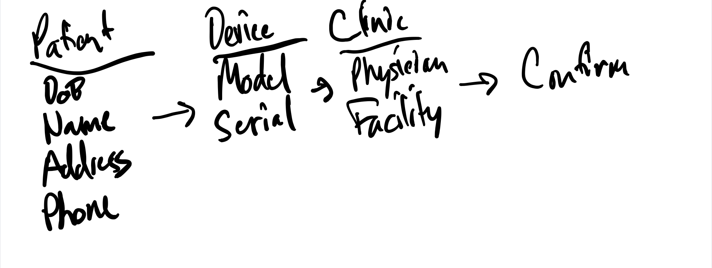

# shape-up

The following repo houses a few documents related to a "real world" example of [Shape Up](https://basecamp.com/shapeup) for a project that attempts to solve device registration for an enterprise.

## The Problem

Currently, across the organization, multiple business units implementa nd re-implement device registration for every product released to market. This is a timely process that consumes months of development time for each new product launch. 

Further more, the company is aiming to expand it's B2C surface area and device registration is seen as an area where we can make a meaningful impact in this direction - by allowing clinicians (and not the sales rep) to register the devices themselves, we can keep cost per new product down and increase our ability to scale. 

## Appetite

Given that the company only exists through the sale of new medical devices, there is a large appetite to solve this issue. 

## Solution

The first six weeks of this pitch, we will need to demonstrate the ability to show a UI form with the following basic elements and capture that data into a datastore. 

The high level user flow will be; 
1. Clinician goes to register patient. 
2. They use our application. 
3. Our appilication pushes that information to downstreams systems. 

The data they need to collect is roughly defined here;

And a more detailed example of the data fields are defined here.

Given we only have six weeks, this first pitch is to get this data collected into a local data store. Future pitches will see us moving that data to the necessary systems. The reason this is broken up is that those down stream systems are huge risks - where we have to be careful the data we send and some data is still entered manually between systems. 

## Rabbit Holes

There are many known rabbit holes that will exist in future pitch documents. Please refer to the no-gos. 

## No-Gos

There are many known rabbit holes that will exist in future pitch documents. For that purpose, we are listing them here has no-gos for this particular pitch to keep scope creep down significantly. 

* Supporting multiple divions
* Supporting Europe and other international terrioties
* Integrating with multiple backend tracking systems / master data record systems
* Integration with queues / message systems to share data 
* Patient device self-registration
* Strong demand from the business to capture more and more information about patients / devices
* Further, new devices can bring in new registration requirements

